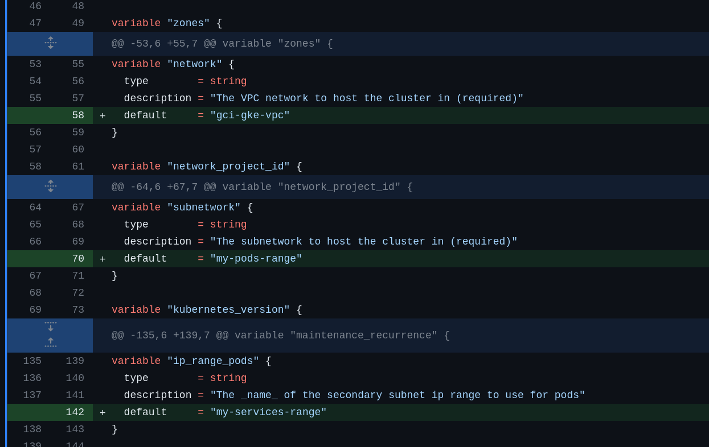
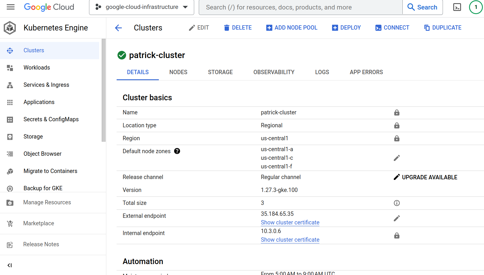

# Step-by-Setp Guide to Deploy a Plain Hello World Page

A plain GKE cluster will be deploy:
- standard, non auto pilot cluster
- A public cluster

## Step 1. VPC and subnet setup:


## Step 2. variables.tf:
- set "goog-cloud-infrastructure" as "project_id"
- set the "name" value which will be the name of the cluster
- set "us-central1" as "region" 
- set "gci-gke-vpc" as "network", this was created in the last step
- set "my-pods-range" as "subnetwork", this was created in the last step
- set "my-services-range" as "kubernetes_version",this was created in the last step
- set "services-range" as "additional_ip_range_pods",this was created in the last step




[changes can be seen here](https://github.com/button-inc/terraform-google-kubernetes-engine/pull/1/files#diff-05b5a57c136b6ff596500bcbfdcff145ef6cddea2a0e86d184d9daa9a65a288e) 

## Step 3. terraform apply:
in the root directory, do the following cmd's

```hcl
terraform init
terraform plan
terraform apply
```
After `terraform apply` runs successfully, you can see the following in GCP:



## deploy hello-world container to a standard cluster:
cd into the `hello-world` directory, do the following cmd's

1. Build the Docker Image for the Application
This command builds a Docker image for the hello-world application using the Dockerfile in the current directory.
```hcl
docker build -t gcr.io/goog-cloud-infrastructure/hello-world:latest .
```

2. Push the Docker Image to Google Container Registry (GCR)
This command pushes the built image to Google Container Registry so that it can be accessed by the GKE cluster.
```hcl
docker push gcr.io/goog-cloud-infrastructure/hello-world:latest
```

3. Configure IAM Permissions
Before the GKE cluster can pull the image from GCR, we need to ensure the service account associated with the cluster's node pool has the appropriate permissions.
```hcl
# Set variables
PROJECT_ID="goog-cloud-infrastructure"
CLUSTER_NAME="patrick-cluster"
REGION="us-central1"

# Get the service account
SERVICE_ACCOUNT=$(gcloud container node-pools describe default-node-pool --cluster=$CLUSTER_NAME --region=$REGION --format="value(config.serviceAccount)")

# Add IAM policy binding to allow the service account to pull images from GCR
gcloud projects add-iam-policy-binding $PROJECT_ID --member=serviceAccount:$SERVICE_ACCOUNT --role=roles/storage.objectViewer
```

4. Get Credentials for the GKE Cluster
This command configures kubectl to use the credentials for the specified GKE cluster.
```hcl
gcloud container clusters get-credentials $CLUSTER_NAME --region $CLUSTER_REGION
```

5. Deploy the Application to GKE
This command applies the Kubernetes deployment defined in the hello-world-deployment.yaml file.
```hcl
kubectl apply -f hello-world-deployment.yaml
```

6. Update the Image for the Deployment
This step ensures that the GKE deployment is using the latest version of the image we pushed to GCR.
```hcl
kubectl set image deployment/hello-world nginx=gcr.io/goog-cloud-infrastructure/hello-world:latest
```

7. Scale the Deployment
This command ensures that the deployment has the desired number of replicas (in this case, 3).

```hcl
kubectl scale deployment hello-world --replicas=3
```

8. Check the Deployment Status
This command lists the deployments in the current namespace to verify the status.
```hcl
kubectl get deployments

kubectl get pods -l app=hello-world -w
```

9. Expose the Application to the Internet
This command creates a LoadBalancer service for the hello-world deployment, allowing external access to the application on port 80.
```hcl
kubectl expose deployment hello-world --type=LoadBalancer --port=80
```

10. Retrieve the External IP Address of the Service
After creating a LoadBalancer service, it might take a few minutes for the external IP address to be assigned. You can use the following command to check the services and retrieve the external IP once it's assigned:
```hcl
kubectl get svc
```

## deploy hello-world container to a autopilot cluster:
Same Steps as 1 & 2 above

3. Configure IAM Permissions Before the GKE cluster can pull the image from GCR
```hcl
export CLUSTER_NAME="simple-autopilot-public-cluster-patrick"
export CLUSTER_REGION="us-central1"
export PROJECT_ID="goog-cloud-infrastructure"

# Get the GKE Autopilot Google-managed service account using the environment variable
SERVICE_ACCOUNT=$(gcloud container clusters describe $CLUSTER_NAME --region $CLUSTER_REGION --format="value(nodeConfig.serviceAccount)")

# Grant the storage.objectViewer role using the environment variable
gsutil iam ch serviceAccount:${SERVICE_ACCOUNT}:roles/storage.objectViewer gs://artifacts.${PROJECT_ID}.appspot.com/
```

Then follow Step 4 & 5 above
Then follow Step 8 & 9 & 10 above

## make changes to the hello-world page, and roll out the updates
1. Update the Website Locally:
Make necessary changes to the website files, e.g., hello_world.html.

2. Rebuild the Docker Image:
```hcl
docker build -t gcr.io/goog-cloud-infrastructure/hello-world:latest .
```

3. Push the Updated Image to Google Container Registry:
```hcl
docker push gcr.io/goog-cloud-infrastructure/hello-world:latest
```

4. Update the Deployment in Kubernetes:
Here, we're using an environment variable change to trigger the rolling update. This approach ensures a new version of the pod is created with the updated image. 
```hcl
kubectl set env deployment/hello-world DEPLOY_DATE="$(date)"
```

5.Monitor the Deployment:
Watch the pods being updated in real-time:
```hcl
kubectl get pods -l app=hello-world -w
```
